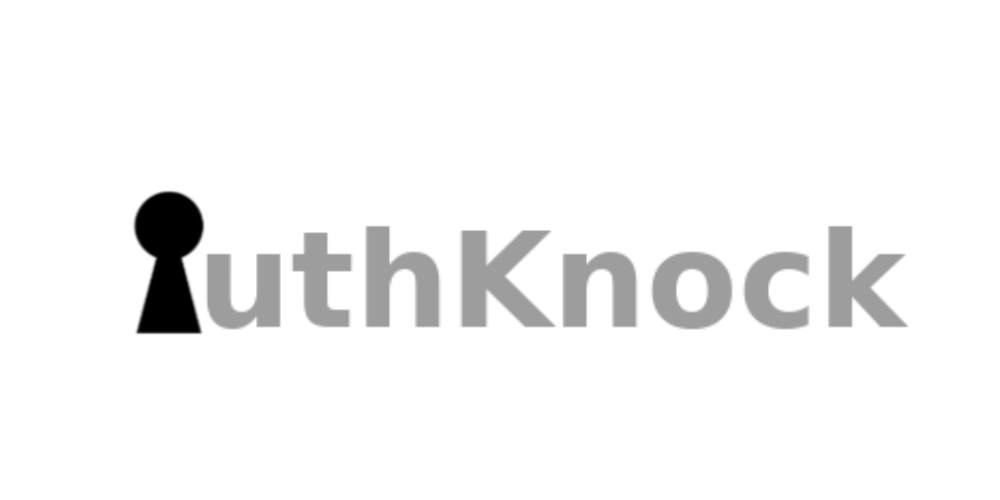

  

<h1 align="center">AuthKnock</h1>

  Dynamic Port opening after Authentication • Automatic VPN configuration • Secure Remote Access • Integration with multiple ecosystems and providers

  
  
  

<footer>Copyright (c) 2026 Twoja_Nazwa

Licensed under the PolyForm Noncommercial License 1.0.0.</footer>
